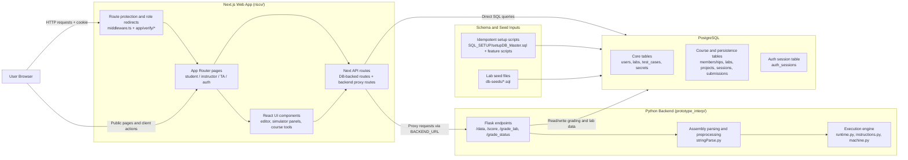
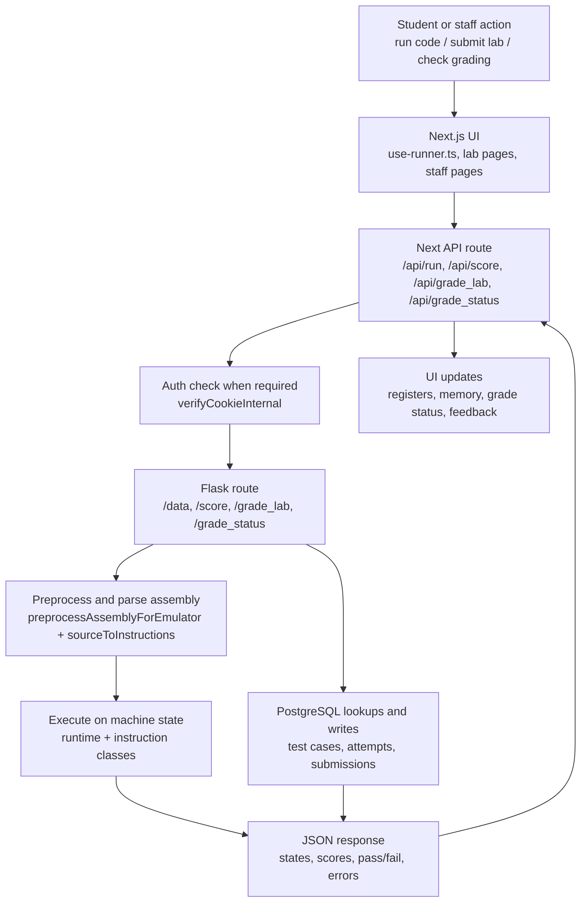

# Architecture Diagram

This document gives a high-level view of the Capstone2 RISC-V app based on the current repo layout and runtime wiring.

## System Overview

## Simulator and Grading Flow

## Primary Responsibility Split

- `riscv/`: user-facing web app, auth/session handling, course/lab/project UI, and server API routes.
- `prototype_interp/`: RISC-V parsing, execution, grading logic, and backend endpoints.
- `SQL_SETUP/`: schema setup and migration-style SQL.
- `db-seeds/`: standalone lab seed content loaded after schema setup.

## Source of Truth Files

- Web entry points: `riscv/app/*`
- Web API routes: `riscv/app/api/*`
- Web DB access: `riscv/app/sql/sql.tsx`
- Auth/session logic: `riscv/app/verify/*`, `riscv/middleware.ts`
- Backend service: `prototype_interp/server.py`
- Emulator core: `prototype_interp/stringParse.py`, `prototype_interp/runtime.py`, `prototype_interp/instructions.py`, `prototype_interp/machine.py`
- Schema setup: `SQL_SETUP/setupDB_Master.sql`
